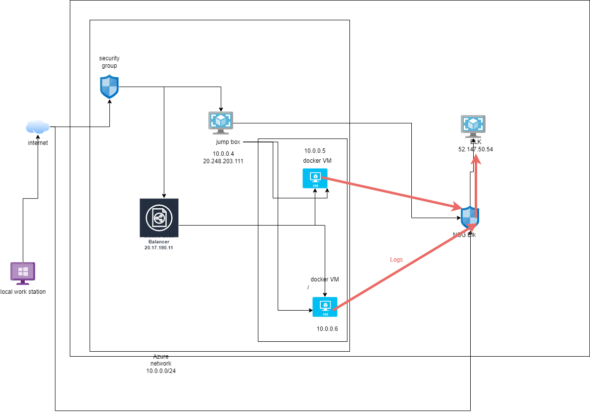
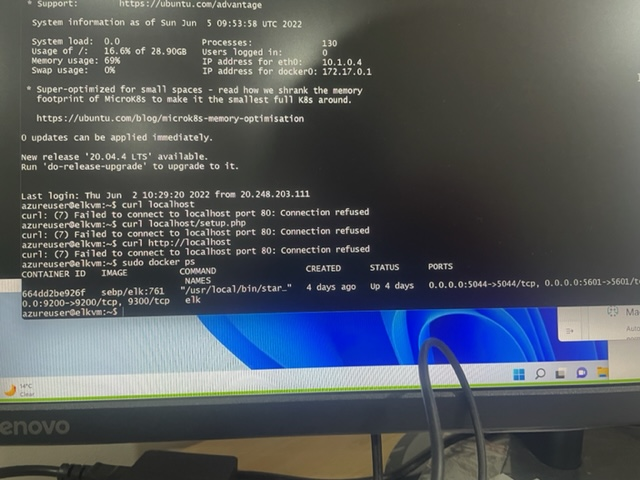

## Automated ELK Stack Deployment

The files in this repository were used to configure the network depicted below.



These files have been tested and used to generate a live ELK deployment on Azure. They can be used to either recreate the entire deployment pictured above. Alternatively, select portions of the yml file may be used to install only certain pieces of it, such as Filebeat.
```
  - ---
- name: Configure Elk VM with Docker
  hosts: elk
  remote_user: azadmin
  become: true
  tasks:
    # Use apt module
    - name: Install docker.io
      apt:
        update_cache: yes
        name: docker.io
        state: present

      # Use apt module
    - name: Install pip3
      apt:
        force_apt_get: yes
        name: python3-pip
        state: present

      # Use pip module
    - name: Install Docker python module
      pip:
        name: docker
        state: present

      # Use sysctl module
    - name: Use more memory
      sysctl:
        name: vm.max_map_count
        value: "262144"
        state: present
        reload: yes

      # Use docker_container module
    - name: download and launch a docker elk container
      docker_container:
        name: elk
        image: sebp/elk:761
        state: started
        restart_policy: always
        published_ports:
          - 5601:5601
          - 9200:9200
          - 5044:5044

      # Use systemd module
    - name: Enable service docker on boot
      systemd:
        name: docker
        enabled: yes
```

This document contains the following details:
- Description of the Topologu
- Access Policies
- ELK Configuration
  - Beats in Use
  - Machines Being Monitored
- How to Use the Ansible Build


### Description of the Topology

The main purpose of this network is to expose a load-balanced and monitored instance of DVWA, the D*mn Vulnerable Web Application.

Load balancing ensures that the application will be highly available_, in addition to restricting access to the network.
- _TODO: What aspect of security do load balancers protect?
Load balancer protect from DOS, accelerate the traffic flow while protecting the IP of the webserver from external network. 
What is the advantage of a jump box?_
It enable the administrator to set up ansible and the dockers to automate the creation and setup of the containers.

Integrating an ELK server allows users to easily monitor the vulnerable VMs for changes to the metrics and system _files____.
- _TODO: What does Filebeat watch for?_ System files access and what files and folders are being requested
- _TODO: What does Metricbeat record
?_The CUP and memory usage, as well as other Vm performance usage

The configuration details of each machine may be found below.
_Note: Use the [Markdown Table Generator](http://www.tablesgenerator.com/markdown_tables) to add/remove values from the table_.

| Name     | Function | IP Address | Operating System |
|----------|----------|------------|------------------|
| Jump Box | Gateway  | 10.0.0.4   | Linux            |
| web-1    | web server         | 10.0.0.7           |   linux               |
| web-2    | web server         | 10.0.0.8           |   linux               |
| elk    | monitor         |52.147.50.54    10.1.0.4         |   linux               |

### Access Policies

The machines on the internal network are not exposed to the public Internet. 

Only the __jumpbox___ machine can accept connections from the Internet. Access to this machine is only allowed from the following IP addresses:
- my public IPs_

Machines within the network can only be accessed by jumpbox__.
- _TODO: Which machine did you allow to access your ELK VM? What was its IP address?_
The Jumpbox (IP 10.0.0.1) can access the ELK and my public IP via a browser. 
A summary of the access policies in place can be found in the table below.

| Name     | Publicly Accessible | Allowed IP Addresses |
|----------|---------------------|----------------------|
| Jump Box | Yes                 | my public IP         |
|web-1     | no                  |    10.0.0.4    |
|wen-2     | no                  |   10.0.0.4     |
|elk       |no                   |  10.0.0.4    |
### Elk Configuration

Ansible was used to automate configuration of the ELK machine. No configuration was performed manually, which is advantageous because...
-it reduces human error and human efforts
it makes the updates faster
it is more scalable than manually creting containers

The playbook implements the following tasks:
- _TODO: In 3-5 bullets, explain the steps of the ELK installation play. E.g., install Docker; download image; etc._

 
    
      # Use apt module
    Install docker.io and pip3
      # Use pip module
    Use the above module
      # Use sysctl module
    for system process
      # Use docker_container module
    to create the container
      # Use systemd module
- ...To make the docker run system commands
- ...

The following screenshot displays the result of running `docker ps` after successfully configuring the ELK instance.



### Target Machines & Beats
This ELK server is configured to monitor the following machines:
-Web 1 10.0.0.7 and web2 10.0.0.8

We have installed the following Beats on these machines:
-filebeat and metricbeat

These Beats allow us to collect the following information from each machine:
filebeat collects the files that are being accessed by users , and metricbeat collects the performance of the VMs (memory, CPU)

### Using the Playbook
In order to use the playbook, you will need to have an Ansible control node already configured. Assuming you have such a control node provisioned: 

SSH into the control node and follow the steps below:
- Copy the YML__ file to  ansible_____.
- Update the ___YML__ file to include hosts IPS
- Run the playbook, and navigate to _the  web1 web2 and ELK___ to check that the installation worked as expected.

_TODO: Answer the following questions to fill in the blanks:_
- _Which file is the playbook? Where do you copy it?_ playbook-filebeat, I copy it in /etc/ansible
- _Which file do you update to make Ansible run the playbook on a specific machine? The hosts file
 How do I specify which machine to install the ELK server on versus which to install Filebeat on?_by updateing the ips of the Hosts file
- _Which URL do you navigate to in order to check that the ELK server is running? http://<elk IP>/app/kibana


_As a **Bonus**, provide the specific commands the user will need to run to download the playbook, update the files, etc._
ansible-playbook elk-install.yml
ansible-playbook pentest.yml
ansible-playbook filebeat.yml
ansible-playbook metricbeat.yml